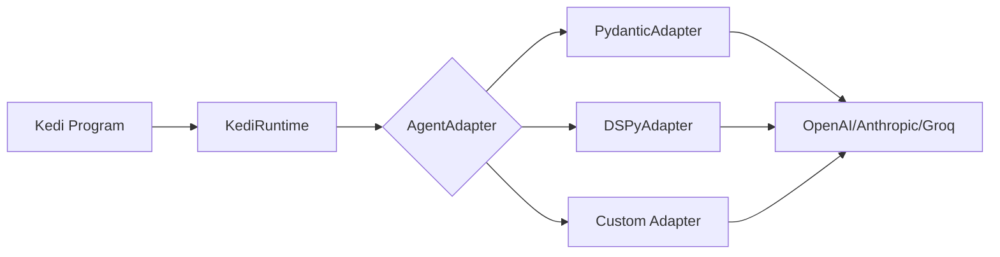

# Agent Adapters

Kedi uses a flexible adapter system to connect to different LLM frameworks. An adapter is responsible for taking a prompt template and output schema, sending it to an LLM, and returning structured results.

---

## Overview



The `AgentAdapter` protocol defines the interface that all adapters must implement. Kedi ships with two built-in adapters:

| Adapter | Framework | Best For |
|---------|-----------|----------|
| **[PydanticAdapter](pydantic.md)** | PydanticAI | Production use, structured outputs, type safety |
| **[DSPyAdapter](dspy.md)** | DSPy | Research, prompt optimization, few-shot learning |

---

## The AgentAdapter Protocol

All adapters implement the `AgentAdapter` protocol:

```python
from typing import Any, Protocol, TypeVar

T = TypeVar("T")

class AgentAdapter(Protocol[T]):
    """Protocol for LLM adapters in Kedi."""
    
    async def produce(
        self,
        template: str,
        output_schema: dict[str, type],
        **kwargs: Any
    ) -> T:
        """
        Async method to produce structured output from an LLM.
        
        Args:
            template: The prompt template with placeholders
            output_schema: Dictionary mapping field names to Python types
            **kwargs: Additional arguments for the LLM
            
        Returns:
            An object with attributes matching the output_schema keys
        """
        ...
    
    def produce_sync(
        self,
        template: str,
        output_schema: dict[str, type],
        **kwargs: Any
    ) -> T:
        """
        Synchronous version of produce().
        
        Most implementations call the async version using asyncio.run().
        """
        ...
```

---

## Output Schema

The `output_schema` parameter is a dictionary mapping output field names to Python types:

```python
output_schema = {
    "name": str,
    "age": int,
    "cities": list[str],
    "metadata": dict[str, Any],
    "person": Person  # Custom Pydantic model
}
```

Kedi automatically builds this schema from your `[output: type]` declarations:

```python title="example.kedi"
# These outputs create the schema:
# {"capital": str, "population": int, "landmarks": list[str]}

The capital of <country> is [capital], the population is [population: int] people, \
famous landmarks include [landmarks: list[str]].
```

---

## Choosing an Adapter

### PydanticAdapter (Default)

Best for:

- ✅ Production applications
- ✅ Strong type validation with Pydantic
- ✅ Structured JSON outputs
- ✅ Simple async/await patterns

```bash
kedi program.kedi --adapter pydantic
```

[Learn more about PydanticAdapter →](pydantic.md)

---

### DSPyAdapter

Best for:

- ✅ Research and experimentation
- ✅ Prompt optimization
- ✅ Few-shot learning
- ✅ Modular LLM pipelines

```bash
kedi program.kedi --adapter dspy
```

[Learn more about DSPyAdapter →](dspy.md)

---

## Model Providers

Both adapters support multiple model providers:

| Provider | Format | Example |
|----------|--------|---------|
| OpenAI | `openai:model` | `openai:gpt-4o` |
| Anthropic | `anthropic:model` | `anthropic:claude-3-5-sonnet-latest` |
| Groq | `groq:model` | `groq:llama-3.1-70b-versatile` |
| Google | `google:model` | `google:gemini-1.5-pro` |
| Ollama | `ollama:model` | `ollama:llama3` |

```bash
kedi program.kedi --adapter-model openai:gpt-4o
```

---

## Using Adapters in Python

You can also use Kedi adapters directly in Python code:

```python
from kedi.agent_adapter import PydanticAdapter, DSPyAdapter
from kedi.core import KediRuntime

# Create an adapter
adapter = PydanticAdapter(model="openai:gpt-4o")

# Create a runtime with the adapter
runtime = KediRuntime(adapter=adapter)

# Use the adapter directly
result = adapter.produce_sync(
    template="The capital of France is [capital].",
    output_schema={"capital": str}
)
print(result.capital)  # "Paris"
```

---

## Creating Custom Adapters

You can create custom adapters by implementing the `AgentAdapter` protocol:

```python
from kedi.agent_adapter import AgentAdapter
from pydantic import create_model
import asyncio

class MyCustomAdapter:
    """Custom adapter implementation."""
    
    def __init__(self, model: str = "my-model"):
        self.model = model
    
    async def produce(
        self,
        template: str,
        output_schema: dict[str, type],
        **kwargs
    ):
        # Build dynamic Pydantic model
        OutputModel = create_model("Output", **{
            k: (v, ...) for k, v in output_schema.items()
        })
        
        # Your LLM call logic here
        response = await self._call_llm(template, output_schema)
        
        # Return validated output
        return OutputModel(**response)
    
    def produce_sync(
        self,
        template: str,
        output_schema: dict[str, type],
        **kwargs
    ):
        return asyncio.run(self.produce(template, output_schema, **kwargs))
```

[Learn more about creating custom adapters →](custom.md)

---

## Next Steps

<div class="grid cards" markdown>

-   :material-robot:{ .lg .middle } **[PydanticAdapter](pydantic.md)**

    Deep dive into the PydanticAI-based adapter.

-   :material-brain:{ .lg .middle } **[DSPyAdapter](dspy.md)**

    Learn about the DSPy-based adapter for research.

-   :material-puzzle:{ .lg .middle } **[Custom Adapters](custom.md)**

    Build your own adapter for any LLM framework.

-   :material-console:{ .lg .middle } **[CLI Reference](../reference/cli.md)**

    Command-line options for adapter selection.

</div>
