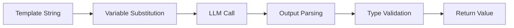

# LLM Integration

The core power of Kedi lies in its ability to treat LLM interactions as typed function calls. Every template line triggers an LLM call, and outputs are automatically parsed and validated.

---

## How It Works



## Template Strings

Any text inside a procedure that is not a variable definition or a return statement is treated as part of the **prompt**. Each line is a separate template that triggers an LLM call.

```python
@write_poem(topic: str) -> str:
    Write a beautiful [poem] as a haiku about <topic>.
    = <poem>
```

When `@write_poem("autumn")` is called:

1. Kedi substitutes `<topic>` → "autumn"
2. Sends prompt to LLM: "Write a beautiful haiku about autumn."
3. LLM responds, Kedi captures content into `[poem]`
4. Returns the captured value

!!! warning "Critical: One Line = One LLM Call"
    Each line in a procedure body is a separate LLM call. To combine multiple lines into a single call, use `\` for line continuation.

## Variable Injection

Use `<variable_name>` to inject values into the prompt:

```python
[style] = "Shakespearean"

@greet(name: str) -> str:
    Compose a [greeting] for <name> in a <style> style.
    = <greeting>
```

### Injection Sources

| Syntax         | Source               |
| -------------- | -------------------- |
| `<param>`      | Procedure parameter  |
| `<local_var>`  | Local variable       |
| `<outer_var>`  | Outer scope variable |
| `<type.field>` | Field of custom type |

## Capturing Output

Use `[variable_name]` to capture the LLM's response:

```python
@analyze(text: str) -> str:
    What is the [sentiment] of this text: <text>?
    = <sentiment>
```

### Output Types

| Annotation           | Capture Type         |
| -------------------- | -------------------- |
| `[name]`             | String (default)     |
| `[name: int]`        | Integer              |
| `[name: float]`      | Floating point       |
| `[name: bool]`       | Boolean              |
| `[name: list]`       | List                 |
| `[name: CustomType]` | Custom Pydantic type |

## Structured Output

Kedi handles the complexity of guiding the LLM to produce valid JSON:

```python
~Color(r: int, g: int, b: int)

@get_color(name: str) -> Color:
    The RGB [color: Color] values for <name>.
    = <color>
```

Kedi automatically:

1. Appends JSON schema instructions to the prompt
2. Parses the LLM response as JSON
3. Validates against the Pydantic model
4. Returns a typed `Color` instance

## Multi-Step Chains

Build complex workflows by chaining procedure calls:

```python
@step1(input: str) -> str:
    First [analysis] of <input>.
    = <analysis>

@step2(analysis: str) -> str:
    Based on <analysis>, provide [recommendations].
    = <recommendations>

@pipeline(data: str) -> str:
    analysis = <step1(<data>)>
    = <step2(<analysis>)>
```

## Best Practices

!!! success "Do"
    - Embed output fields naturally in sentences
    - Use line continuation for complex prompts
    - Define custom types for structured data
    - Validate outputs with type annotations

!!! danger "Don't"
    - Put output fields on separate lines
    - Use instruction-like output syntax
    - Forget line continuation for multi-line prompts
    - Leave outputs untyped when structure is needed
